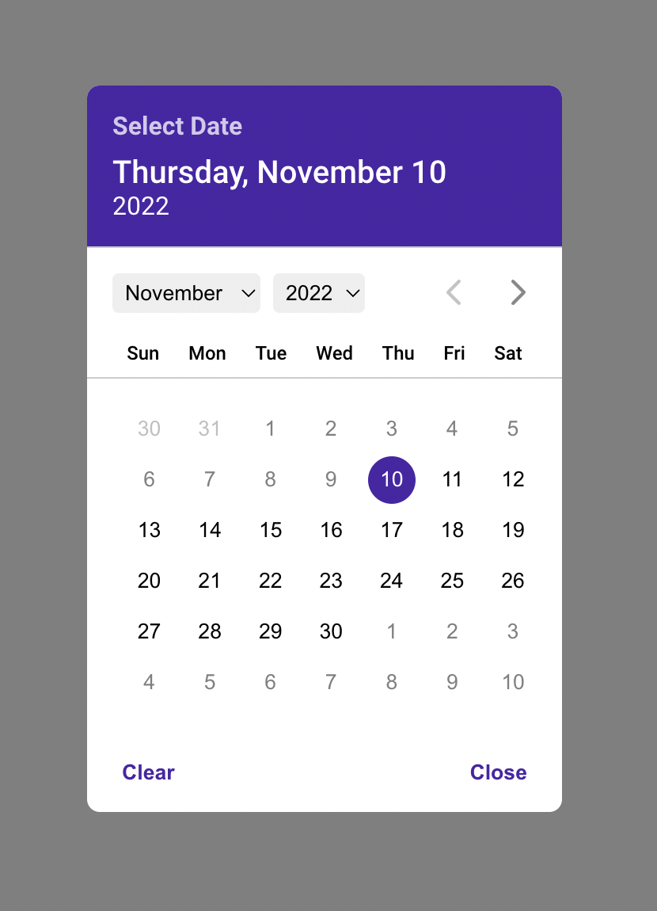

# React Responsive Datepicker
[](https://www.npmjs.com/package/react-responsive-datepicker) [](https://standardjs.com)

This is a React Library for your projects to make datepicker looks great!
## Features

- Awesome UI
- Customable
- Mobile friendly
- Add min and max date
- Just use Vanilla JS to modify date

And of course Dillinger itself is open source with a [public repository][dill]
 on GitHub.

## Installation

```
npm install --save react-responsive-datepicker
```
or use yarn
```
yarn add react-responsive-datepicker
```



## Example
```tsx
import React from 'react'

import { DatePicker } from 'react-responsive-datepicker'
import 'react-responsive-datepicker/dist/index.css'

const App = () => {
  const [isOpen, setIsOpen] = React.useState(false)

  return (
    <div>
      <button
        onClick={() => {
          setIsOpen(true)
        }}
      >
        Open
      </button>
      <DatePicker
        isOpen={isOpen}
        onClose={() => setIsOpen(false)}
        defaultValue={new Date(2022, 8, 8)}
        minDate={new Date(2022, 10, 10)}
        maxDate={new Date(2023, 0, 10)}
        headerFormat='DD, MM dd'
      />
    </div>
  )
}

export default App

```

## Props
These are the props to custom your datepicker.
| Prop | Required | Type | Default |
| ------ | ------ | ------ | ------- |
| isOpen | ✅ | `boolean` | false |
| defaultValue | ❌ | `Date` | null |
| title | ❌ | `string` | Select Date |
| showTitle | ❌ | `boolean` | true |
| minDate | ❌ | `Date` | null |
| maxDate | ❌ | `Date` | null |
| onChange | ❌ | `(date: Date) => void` |
| onClose | ❌ | `() => void` |
| closeText | ❌|  `string`|Close|
| clearText | ❌|  `string `|Clear|
| headerFormat|❌ | `Date format` |  
| monthNames | ❌| `string[]`|english month names|
| dayNames | ❌| `string[]`|english day names|
| headerBackgroundColor | ❌| `string`|purple|

## Date Formats
- _D_ to show short day name, etc. Sun, Tue.
- _DD_ to show day name, etc. Sunday, Monday.
- _d_ to show date without 0.
- _dd_ to show date with 0.
- _MM_ to show month name, etc. January, March.
- _M_ to show short month name, etc. Jan, Mar.
- _m_ to show month number.
- _mm_ to show month number with 0.

## License
MIT © [agunbuhori](https://github.com/agunbuhori)

## Made with ❤️
By Agun Buhori
